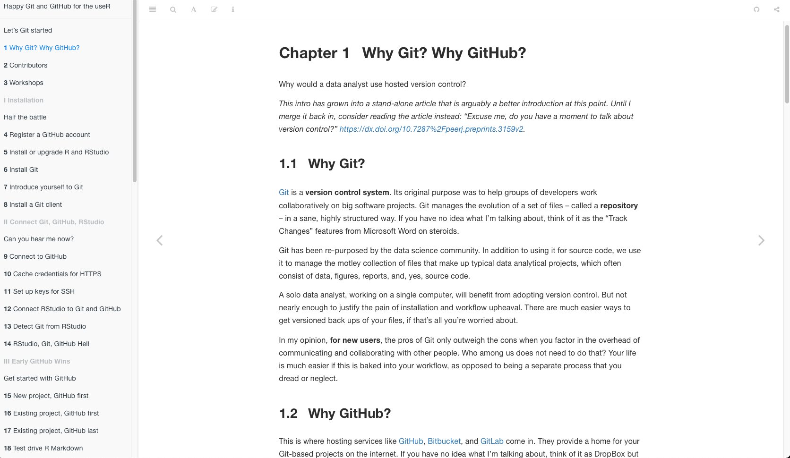
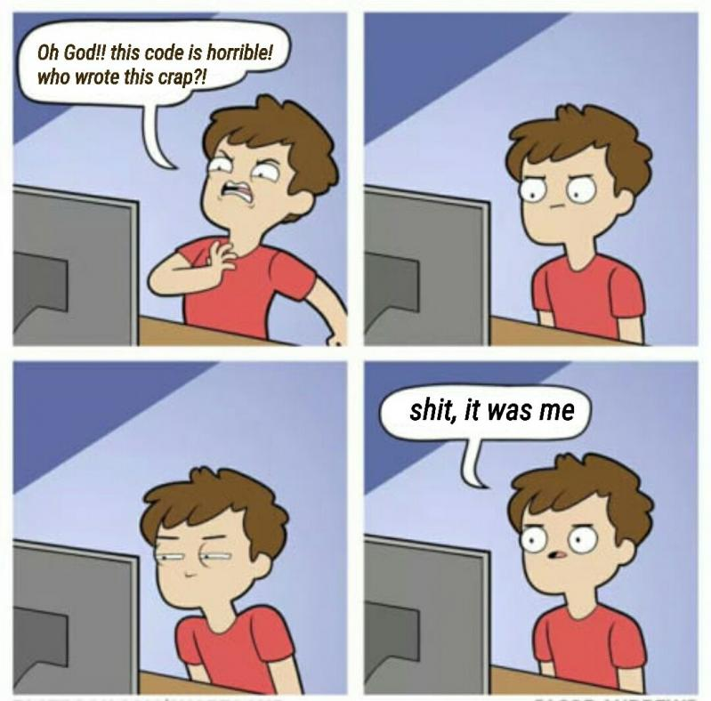
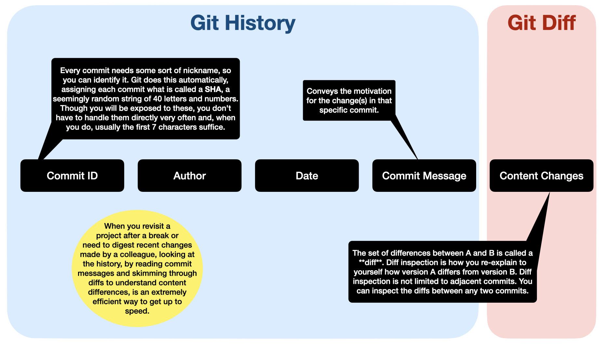
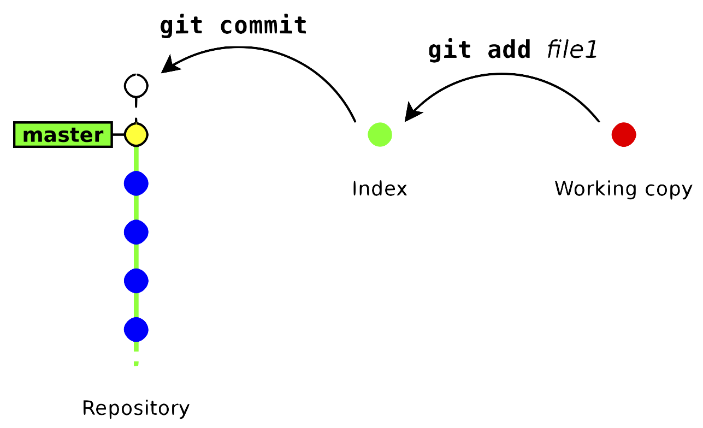
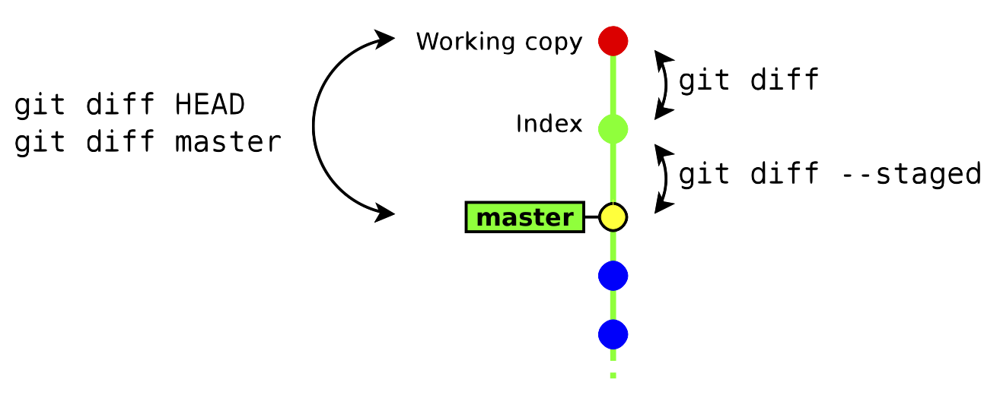
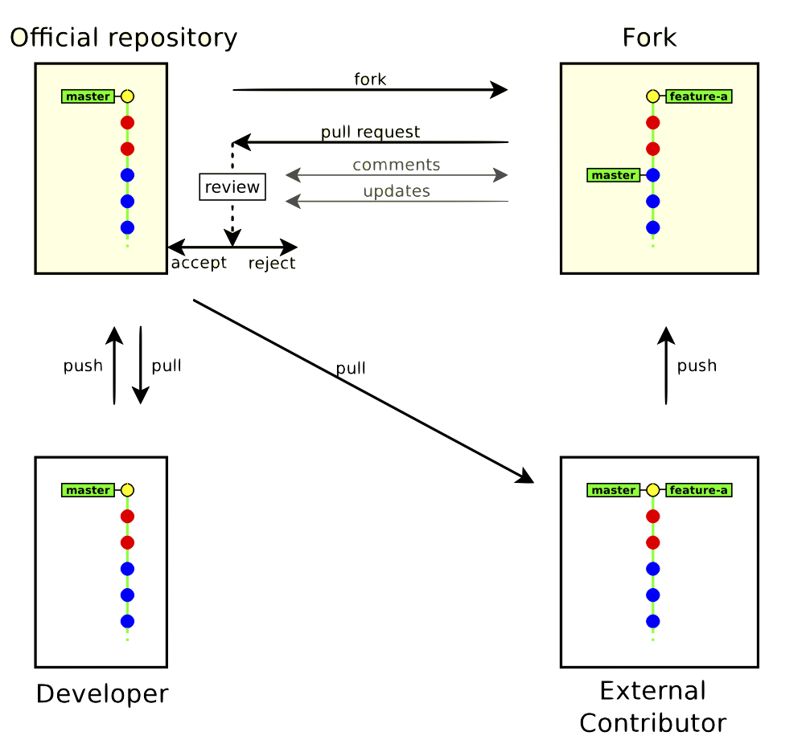

```{r setup, include=FALSE}
knitr::opts_chunk$set(echo = TRUE, comment = "")
htmltools::tagList(
  xaringanExtra::use_clipboard(
    button_text = "<i class=\"fa fa-clipboard\"></i>",
    success_text = "<i class=\"fa fa-check\" style=\"color: #90BE6D\"></i>",
    error_text = "<i class=\"fa fa-times-circle\" style=\"color: #F94144\"></i>"
  ),
  rmarkdown::html_dependency_font_awesome()
)
```

## A good reference {.flexbox .vcenter}

### Happy Git and GitHub for the useR

*Jenny Bryan, the STAT 545 TAs, Jim Hester*

<https://happygitwithr.com>

{width="820"}

## Your turn

- Create a Github account
- Create a temporary folder somewhere on your computer to store what we will do today
- Download the slides: https://github.com/astamm/git-workshop/blob/master/git-workshop-build.html
- Open the HTML slides in Google Chrome

# What and why Git ?

## Git - History Tracker {.flexbox .vcenter}

::: {.columns-2}
[{width=283}](https://en.wikipedia.org/wiki/File:Back_to_the_Future_Part_II.jpg)

The life of your software is recorded from the beginning.

-   at any moment you can revert to a previous revision

-   the history is browseable, you can inspect any revision

    -   when was it done ?
    -   who wrote it ?
    -   what was changed ?
    -   why ?
    -   in which context ?

-   all the deleted content remains accessible in the history
:::

## Git - Team Collaboration {.flexbox .vcenter}

::: {.columns-2}
[{width=365}](https://devrant.com/rants/811491/git-blame-strikes-again)

Git helps you to:

-   share a collection of files with your team
-   merge changes done by other users
-   ensure that nothing is accidentally overwritten
-   know who you must blame when something is broken
:::

## Git - Multiple Version Maintenance {.flexbox .vcenter}

::: {.columns-2}
[{width="315"}](https://www.phdcomics.com)

You may have multiple variants of the same software, materialized as
**branches**, for example:

-   a main branch
-   a maintenance branch (to provide bugfixes in older releases)
-   a development branch (to make disruptive changes)
-   a release branch (to freeze code before a new release)

Git will help you to:

-   handle multiple branches concurrently
-   merge changes from a branch into another one
:::

## Git - External Contribution Manager {.flexbox .vcenter}

::: {.columns-2}
[{width="480"}](https://happygitwithr.com)

Git helps working with third-party contributors:

-   it gives them visibility of what is happening in the project
-   it helps them to submit changes (patches) and it helps you to
    integrate these patches
-   forking the development of a software and merging it back into
    mainline
:::

## Install Git

+-------------------------------------------------------+--------------------------+---------------------------------------------------+
| Windows                                               | macOS                    | Linux                                         |
+=======================================================+==========================+===================================================+
| [Git for Windows](https://git-for-windows.github.io/) | `xcode-select --install` | `sudo apt-get install git` (Ubuntu or Debian) |
|                                                       |                          | `sudo yum install git` (Fedora or RedHat)     |
+-------------------------------------------------------+--------------------------+---------------------------------------------------+

### Note for Windows users

- When asked about “Adjusting your PATH environment”, make sure to select “Git from the command line and also from 3rd-party software”. Otherwise, we believe it is good to accept the defaults.
- Note that RStudio for Windows prefers for Git to be installed below `C:/Program Files` and this appears to be the default. Unless you have specific reasons to otherwise, follow this convention.

### Introduce yourself

In the shell:
```{bash, eval=FALSE}
git config --global user.name 'Jane Doe'
git config --global user.email 'jane@example.com'
```
substituting your name and **the email associated with your GitHub account**.

## Your turn

- Download the slides: https://github.com/astamm/git-workshop/blob/master/git-workshop-build.html
- Open the HTML slides in Google Chrome
- Open a terminal (macOS or Linux) or Git Bash app on Windows and introduce yourself to Git

# The Git Jargon

## Repository

Git is a version control system whose original purpose was to help
developers work collaboratively on big software projects. Git manages
the evolution of a set of files called a **repository** (repo).

**For new or existing projects, we recommend that you:**

-   Dedicate a local directory to it.
-   Make it a Git repository.

**How often and when should I do that?**

-   happens once per project.
-   can happen at project inception or at any later point.

**Should I then be afraid of this new folder *linked to Git* ?**

-   Chances are your existing projects each already live in a dedicated
    directory.
-   Making such a directory a Git repository boils down to allowing Git
    to leave notes for itself in hidden files or directories.
-   The project is still a regular directory on your computer, that you
    can locate, name, move, and generally interact with as you wish. You
    don't have to handle it with special gloves!

## Commits

The daily workflow is probably not dramatically different from what you
do currently. You work in the usual way, writing R scripts or authoring
reports in LaTeX or R Markdown. But instead of only *saving* individual
files, periodically you make a **commit**, which takes a snapshot of all
the files in the entire project.

**Chances are you are already into Git practices without knowing it**

+--------------------+--------------------------+---------------------+--------------+
| Task               | Purpose                  | Most researchers'   | Git          |
|                    |                          | approach            | approach     |
+====================+==========================+=====================+==============+
| Versioning         | You wrote a file which   | [Append your        | Make a       |
|                    | is at a version that is  | initials and the    | commit.      |
|                    | significant to you and   | date](              |              |
|                    | that you might want to   | http://www.phdcomic |              |
|                    | inspect or revert to     | s.com/comics/archiv |              |
|                    | later. Or you are        | e.php?comicid=1531) |              |
|                    | reviewing a version of   | at the end of the   |              |
|                    | someone else's document. | current file name.  |              |
+--------------------+--------------------------+---------------------+--------------+
| Backuping, Sharing | You optimized and tested | In addition to a    | Periodically |
|                    | exhaustively your code.  | saved copy on your  | push         |
|                    | You want to release it.  | computer, save it   | commits to   |
|                    | It is a so important     | also on an external | GitHub.      |
|                    | version that you want to | hard drive, a cloud |              |
|                    | keep it for archive and  | such as CNRS        |              |
|                    | make sure it can never   | Seafile or UNCLOUD. |              |
|                    | accidentally be lost.    |                     |              |
+--------------------+--------------------------+---------------------+--------------+

## Structure of a commit {.flexbox .vcenter}

{width="900"}

## Commit history of a single file {.flexbox .vcenter}

{width="600"}

**Tags.** You can also designate certain snapshots as special with a **tag**,
which is a name of your choosing. In a software project, it is typical
to tag a release with its version, e.g., "v1.0.3". For a manuscript or
analytical project, you might tag the version submitted to a journal or
transmitted to external collaborators.

# Working locally

## Create a new repository

```{bash, eval=FALSE}
### <b>
git init myrepository # Creates the directory myrepository and make it a Git repo
git init # Makes the current directory a Git repo
### </b>
```

This command creates the directory `myrepository`.

-   The repository is located in the hidden folder `myrepository/.git/`
-   The (initially empty) working copy is located in the folder
    `myrepository/`

```{bash, echo=FALSE}
rm -fr macs
```

<div class="columns-2">
```{bash}
git init macs
```

```{bash}
ls -a macs
```

```{bash}
ls macs/.git/
```
</div>

## Inspect current state of your Git repo

```{bash}
cd macs
git status # show the status of the index and working copy
```

```{bash, echo=-1}
cd macs
echo 'Hello World!' > hello
git status
```

## Commit your first files

```{bash, eval=FALSE}
### <b>
git add files # Copy files into the index
git commit [-m message] # Commits the content of the index
### </b>
```

<div class="columns-2">
```{bash, echo=-1}
cd macs
git add hello
git status
```

```{bash, echo=-1}
cd macs
git commit -m "added file 'hello'"
```

```{bash, echo=-1}
cd macs
git status
```
</div>

## Staging area

{width=880}

## Update a file

```{bash, echo=-1, error=TRUE}
cd macs
echo "Happy" >> hello
git commit
```

```{bash, echo=-1}
cd macs
git add hello
git commit -m "added Happy to hello content"
```

## Deleting a file

```{bash, eval=FALSE}
git rm file # remove the file from the index and from the working copy
git commit # commit the index
```

```{bash, echo=-1}
cd macs
git rm hello
```

```{bash, echo=-1}
cd macs
git commit -m "removed hello"
```

## Showing differences

```{bash, eval=FALSE}
git diff [rev_a [rev_b]] [-- path ...]
```

Shows the differences between two revisions `rev_a` and `rev_b`. By default:
- `rev_a` is the **index**,
- `rev_b` is the **working copy**.

```{bash, eval=FALSE}
git diff --staged [rev_a] [-- path ...]
```

Shows the differences between `rev_a` and the index. By default:
- `rev_a` is `HEAD` (symbolic reference to last commit).

## About `git diff` and the index

{width=880}

## Diff examples

```{bash, echo=-1}
cd macs
echo foo >> hello
git add hello
echo bar >> hello
```

<div class="columns-2">
```{bash, echo=-1}
cd macs
git diff
```

```{bash, echo=-1}
cd macs
git diff --staged
```

```{bash, echo=-1}
cd macs
git diff HEAD
```
</div>

## Reset changes

```{bash, eval=FALSE}
git reset [--hard] [-- path ...]
```

- `git reset` drops the changes staged into the index (restores files as they were in last commit),
- `git reset --hard` drops all the changes in the index **and** in the working copy.

```{bash, eval=FALSE}
git checkout -- path
```

This command restores a file (or directory) as it appears in the index (thus it drops all unstaged changes).

<div class="columns-2">
```{bash, echo=-1}
cd macs
git diff HEAD
```

```{bash, echo=-1}
cd macs
git checkout -- .
git diff HEAD
```
</div>

## History

```{bash, echo=-1}
cd macs
git log
```

## Other local commands

Commit details:
```{bash, echo=-1}
cd macs
git show
```

```{bash, eval=FALSE}
git mv # move or rename a file
git tag # create or delete tags
```

# Git Clients

## A picture is worth a thousand words {.flexbox .vcenter}

{height=370}

{height=370}

Which do you prefer ?

## Recommended Git clients {.flexbox .vcenter}

- [GitKraken](https://www.gitkraken.com/) is a free, powerful Git(Hub) client. It’s especially exciting because it works on Windows, macOS, and Linux. This is great news, especially for long-suffering Linux users who have previously had very few options.

- [SourceTree](https://www.sourcetreeapp.com/) is an alternative free client for Windows users.

- GitHub offers a free Git(Hub) client, [GitHub Desktop](https://desktop.github.com/), for Windows and macOS. GitHub Desktop is aimed at beginners who want the most useful features of Git front and center.

**DEMO**

## Your turn

- Download the slides: https://github.com/astamm/git-workshop/blob/master/git-workshop-build.html
- Open the HTML slides in Google Chrome
- Open a terminal (macOS or Linux) or Git Bash app on Windows and introduce yourself to Git
- Install [GitKraken](https://www.gitkraken.com/) and open it as well (take time to answer the initial questions)

# Going live

## Ways to go live

### GitHub

Go to https://github.com and make sure you are logged in.

Click green “New repository” button. Or, if you are on your own profile page, click on “Repositories”, then click the green “New” button.

- Repository name: `myrepo` (or whatever you wish)
- Public
- YES Initialize this repository with a README

Click the big green button “Create repository.”

Copy the HTTPS clone URL to your clipboard via the green “Clone or Download” button. Or copy the SSH URL if you chose to set up SSH keys.

### [GitLab](https://gitlab.com) and [Bitbucket](https://bitbucket.org)

Refer to (https://happygitwithr.com/new-github-first.html#make-a-repo-on-github-2).

## Connect to GitHub

It is likely that your first push leads to a challenge for your GitHub username and password. This will drive you crazy in the long-run and make you reluctant to push. You want to eliminate this annoyance.

You should set up once and for all a Personal Access Token (PAT).

Use it as password the first time a Git command prompts you for your credentials.

GitHub will no longer bother you with credentials after that.

**Main recommendations**

- Adopt HTTPS as your Git transport protocol
- Turn on two-factor authentication for your GitHub account
- Use a personal access token (PAT) for all Git remote operations: https://github.com/settings/tokens
- Allow tools to store and retrieve your credentials from the Git credential store.

**DEMO**

## Your turn

- Download the slides: https://github.com/astamm/git-workshop/blob/master/git-workshop-build.html
- Open the HTML slides in Google Chrome
- Open a terminal (macOS or Linux) or Git Bash app on Windows and introduce yourself to Git
- Install [GitKraken](https://www.gitkraken.com/) and open it as well (take time to answer the initial questions)
- Go to GitHub and fork the `astamm/git-workshop` repo in your account
- Clone the repo from your account on your computer (via GitKraken)

## Different contexts

- [New project, GitHub first](https://happygitwithr.com/new-github-first.html)

We create a new project, with the preferred “GitHub first, then RStudio” sequence. Why do we prefer this? Because this method of copying the Project from GitHub to your computer also sets up the local Git repository for immediate pulling and pushing. **In the absence of other constraints, I suggest that all of your R projects have exactly this set-up.**

- [Existing project, GitHub first](https://happygitwithr.com/existing-github-first.html)

This is the main approach if you already have a local existing project that you want to bring on GitHub.

- [Existing project, GitHub last](https://happygitwithr.com/existing-github-last.html)

An explicit workflow for connecting an existing local R project to GitHub, when for some reason you cannot or don’t want to do a “GitHub first” workflow. When does this come up? Example: it’s an existing project that is already a Git repo with a history you care about. Then you have to do this properly.

- Contribute to an existing repo.

## Own, clone, fork {.flexbox .vcenter}

{height=480}

## Good Habits - Day 1 - Work in branches

1. Connect a local directory to the remote team repo https://github.com/astamm/macs.git

   +------------------------------------------------------------------+--------------------------------------------------------+
   | Team Member                                                      | External Collaborator                          |
   +==================================================================+========================================================+
   | `git clone https://github.com/astamm/macs.git some_local_folder` | [Forking process](https://github.com/astamm)   |
   +------------------------------------------------------------------+--------------------------------------------------------+

2. From the `master` branch, retrieve last modifications made to `master` branch via `git pull`;
3. From the `master` branch, create another branch `my_awesome_feature` for implementing your brand new feature in the software via `git checkout -b my_awesome_feature`;
4. Write down your code locally;
5. Stage (`git add` to transfer to staging area) edited files;
6. Commit (`git commit [-m msg]` to register staged work);
7. Push (`git push` to send to remote branch);
8. Rinse and repeat from Step 4.

## Good Habits - Day 2 - Stay tuned

**This is the recommended workflow when you are already developing a new feature in a branch.**

1. Put your local folder on `master branch` via `git checkout master`;
2. From the `master` branch, retrieve last modifications made to `master` branch via `git pull`;
3. From the `my_awesome_feature` branch, retrieve last modifications made to `master` branch via `git merge master`;
4. Write down your code locally;
5. Stage (`git add` to transfer to staging area) edited files;
6. Commit (`git commit [-m msg]` to register staged work);
7. Push (`git push` to send to remote branch);
8. Rinse and repeat from Step 4.

## Good Habits - Day 42 - Make pull requests

When you are satisfied with your implementation of the feature:

- you create a pull request (PR) for integrating your work in the original `master` branch;
- it is then reviewed by the maintainer and whoever you assigned to your PR;
- after some comment iterations between him/her and you, (s)he merges the PR;
- you can move back on the master and do a `git pull` to make sure your local master matches the updated remote master.
- you can start again with a new branch for a new feature.

## A note on forking

When you are not part of the team, you can still contribute by **forking** the remote repo from GitHub.

1. Forking makes a *copy* of the master remote into your GitHub account under the same repo name;
2. When you `git clone` it, the remote master `origin/master` points to the **forked** master, which is why you can then `git push` to it;
3. The forked master should **never be modified**;
4. If you want to stay tuned (keep track) with the latest changes in original master, you need to manually add a remote via `get remote add`. By convention, the original repo should be called `upstream`;
   ```{bash, eval=FALSE}
   git remote add upstream https://github.com/OWNER/REPO.git
   ```
5. Now you can stay up to date whenever you want by going to your master branch and execute
   ```{bash, eval=FALSE}
   git pull upstream master
   ```
Then you will `git push` to save the modifications also on your forked master.
6. Finally you can switch back to your branch via `git checkout my_awesome_branch` and `git merge master` to make also your branch up to date.

## Good habits - Summing up

**Remember that the origin master branch is the one used by the world to install your software.**

Four rules to adopt that will make your life easy

- new feature = new branch;
- always pull before working + merge from master to stay up to date with the latest approved changes in the software;
- propose pull request to integrate your work officially in the software.
- never modify a forked master branch.

In other words:

- before a coding session, make your masters and branches up to date.
- at the end of your coding section, every file that has been created or modified should be committed and pushed in the corresponding branch.

## Your turn

- Download the slides: https://github.com/astamm/git-workshop/blob/master/git-workshop-build.html
- Open the HTML slides in Google Chrome
- Open a terminal (macOS or Linux) or Git Bash app on Windows and introduce yourself to Git
- Install [GitKraken](https://www.gitkraken.com/) and open it as well (take time to answer the initial questions)
- Go to GitHub and fork the `astamm/git-workshop` repo in your account
- From GitKraken

  - Clone the repo from your account on your computer (via GitKraken)
  - Create a branch `YOU-intro`, where `YOU` should be replaced with your name (lower case)
  - Switch to this branch
- Add a `.txt` file that contains your name, email adress and computer skill learning interests.
- Stage, commit and push the file on the branch `YOU-intro` (from GitKraken)
- Make a pull request to my workshop repo (from GitHub)

## The Maintainer

**Do this once per new project.**

Go to https://github.com and make sure you are logged in.

Click green “New repository” button. Or, if you are on your own profile page, click on “Repositories”, then click the green “New” button.

- Repository name: myrepo (or whatever you wish)
- Public
- YES Initialize this repository with a README

Click the big green button “Create repository.”

Copy the HTTPS clone URL to your clipboard via the green “Clone or Download” button. Or copy the SSH URL if you chose to set up SSH keys.

In a Bash terminal, type
```{bash, eval=FALSE}
git clone paste_from_clipboard folder_you_want_to_clone_into/
```

## Side note for LMJL members {.flexbox .vcenter}

If you want to experiment team work, I can set up team GitHub projects and add you as members.

# R, RStudio, Git

## The [**usethis**](https://usethis.r-lib.org/index.html) package

- Tweak your `.Rprofile` setup with `use_devtools()` and `edit_r_profile()`
- Create a new package instantly with `create_package()` with automatic setup of roxygen for handling documentation
- Choose a license with `use_XXX_license()`
- Set up your package directory as a Git repo: `use_git()`
- Host it on GitHub with `use_github()`
- Add package dependencies with `use_package()`
- Add data to your package with `use_data()`
- Add global documentation for your package with `use_package_doc()`
- Add an README file as a showcase as an R markdown file with `use_readme_rmd()`
- Add a NEWS.md file for reporting novelties at each release with `use_news_md()`
- Add vignettes to detail parts of your package with `use_vignette()`
- Add unit testing to your package for every function you write with `use_testthat()` and `use_test()`
- Run the tests with `devtools::test()`

## RStudio API for Git operations {.flexbox .vcenter}

- Use RStudio API helpers to document your functions
- Rebuild setup

**DEMO**
